Activity 4 - Day 1
================

### Task 2: Load the necessary packages

``` r
library(tidyverse)
```

    ## ── Attaching packages ─────────────────────────────────────── tidyverse 1.3.2 ──
    ## ✔ ggplot2 3.3.6     ✔ purrr   0.3.4
    ## ✔ tibble  3.1.8     ✔ dplyr   1.0.9
    ## ✔ tidyr   1.2.0     ✔ stringr 1.4.1
    ## ✔ readr   2.1.2     ✔ forcats 0.5.2
    ## ── Conflicts ────────────────────────────────────────── tidyverse_conflicts() ──
    ## ✖ dplyr::filter() masks stats::filter()
    ## ✖ dplyr::lag()    masks stats::lag()

``` r
library(tidymodels)
```

    ## ── Attaching packages ────────────────────────────────────── tidymodels 1.0.0 ──
    ## ✔ broom        1.0.0     ✔ rsample      1.1.0
    ## ✔ dials        1.0.0     ✔ tune         1.0.0
    ## ✔ infer        1.0.3     ✔ workflows    1.0.0
    ## ✔ modeldata    1.0.0     ✔ workflowsets 1.0.0
    ## ✔ parsnip      1.0.1     ✔ yardstick    1.0.0
    ## ✔ recipes      1.0.1     
    ## ── Conflicts ───────────────────────────────────────── tidymodels_conflicts() ──
    ## ✖ scales::discard() masks purrr::discard()
    ## ✖ dplyr::filter()   masks stats::filter()
    ## ✖ recipes::fixed()  masks stringr::fixed()
    ## ✖ dplyr::lag()      masks stats::lag()
    ## ✖ yardstick::spec() masks readr::spec()
    ## ✖ recipes::step()   masks stats::step()
    ## • Use suppressPackageStartupMessages() to eliminate package startup messages

``` r
library(GGally)
```

    ## Registered S3 method overwritten by 'GGally':
    ##   method from   
    ##   +.gg   ggplot2

### Task 3: Load the data and

``` r
evals <- read.delim("https://www.openintro.org/data/tab-delimited/evals.txt")
```

This is an experimental study.

From the histogram output, the distribution of score is the kind of left
skewed.

``` r
# Age vs beauty average
evals %>% ggplot(aes(x = age,
                   y = bty_avg)) + 
  geom_point(alpha=0.20) +
  geom_smooth(se = FALSE, method = "lm", size = 1) +
  labs(title = "Relationship between age and beauty avg",
       x = "Age of Professor",
       y = "Average beauty rating of professor",
       caption = "Data source: The OpenIntro site") + 
  theme_bw()
```

    ## `geom_smooth()` using formula 'y ~ x'

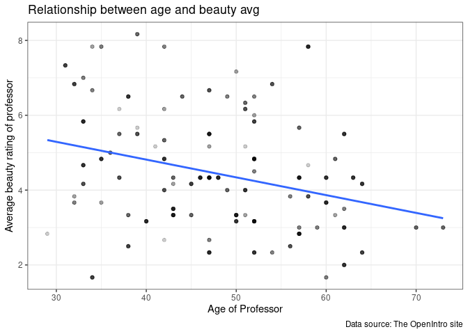<!-- -->

Age appears to have an influence on average beauty rating. It shows a
decline in mean beauty rating as age increases.

``` r
# Average beauty vs score
evals %>% ggplot(aes(x = bty_avg,
                   y = score)) + 
  geom_point(alpha=0.20) +
  geom_smooth(se = FALSE, method = "lm", size = 1) +
  labs(title = "Relationship between Average Beauty Rating and Evaluation Scores",
       x = "Average Beauty Rating",
       y = "Evalution scores",
       caption = "Data source: The OpenIntro site") + 
  theme_bw()
```

    ## `geom_smooth()` using formula 'y ~ x'

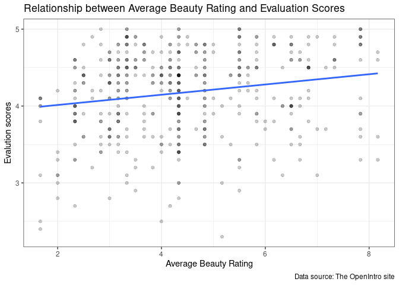<!-- -->

``` r
# Fitting the model for Average beauty rating and Scores
m_bty <- lm(score ~ bty_avg, data = evals)
tidy(m_bty)
```

    ## # A tibble: 2 × 5
    ##   term        estimate std.error statistic   p.value
    ##   <chr>          <dbl>     <dbl>     <dbl>     <dbl>
    ## 1 (Intercept)   3.88      0.0761     51.0  1.56e-191
    ## 2 bty_avg       0.0666    0.0163      4.09 5.08e-  5

``` r
plot(m_bty)
```

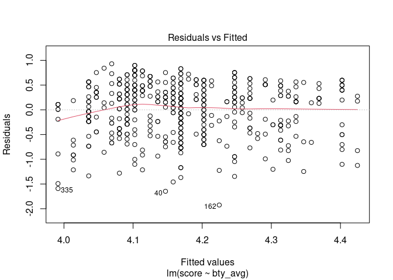<!-- -->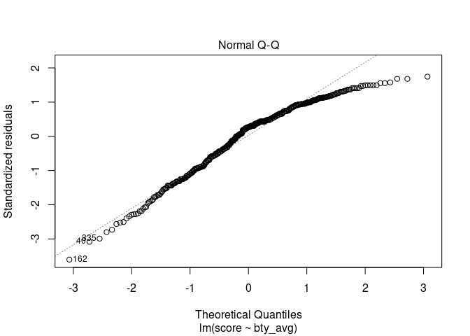<!-- -->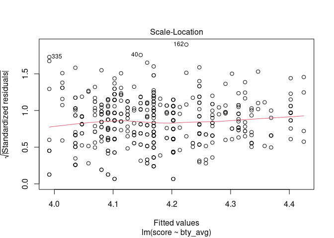<!-- -->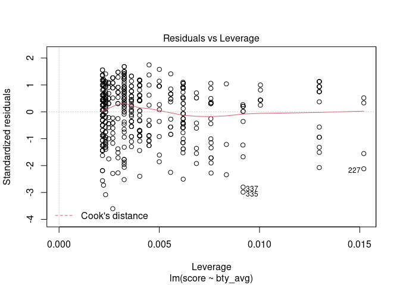<!-- -->

### Simplified equation of the line corresponding to score:

Estimated score = beta0hat + beta1hat(bty\_avg) = 3.88033795 +
0.06663704(bty\_avg)

### Interpretation:

Intercept 3.88 is significantly different from zero. For professors with
a beauty average rating of 0, we expect their mean evaluation score to
be 3.88.

First slope 0.066 is significantly different from 0. Every 1-unit
increase in beauty average rating scale is associated with 0.066
increase in the average evaluation score.

### Task 4: Pairwise relationships

``` r
# Pairwise relationships
evals %>% 
  select(starts_with("bty_")) %>% 
  ggpairs()
```

<!-- -->

I recommend to include “beauty average” and “beauty rating of professor
from upper level male” for our model.

### Task 5: Multiple linear regression: one quantitative predictor, one qualitative predictor

``` r
# Fitting the model
m_bty_gen <- lm(score ~ bty_avg + gender, data = evals)
tidy(m_bty_gen)
```

    ## # A tibble: 3 × 5
    ##   term        estimate std.error statistic   p.value
    ##   <chr>          <dbl>     <dbl>     <dbl>     <dbl>
    ## 1 (Intercept)   3.75      0.0847     44.3  6.23e-168
    ## 2 bty_avg       0.0742    0.0163      4.56 6.48e-  6
    ## 3 gendermale    0.172     0.0502      3.43 6.52e-  4

``` r
plot(m_bty_gen)
```

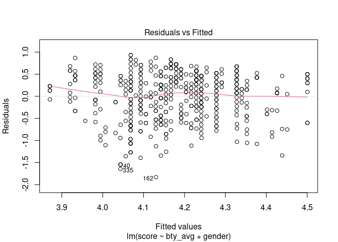<!-- -->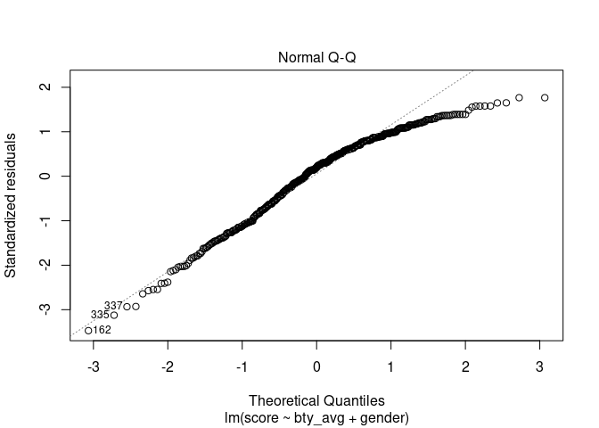<!-- -->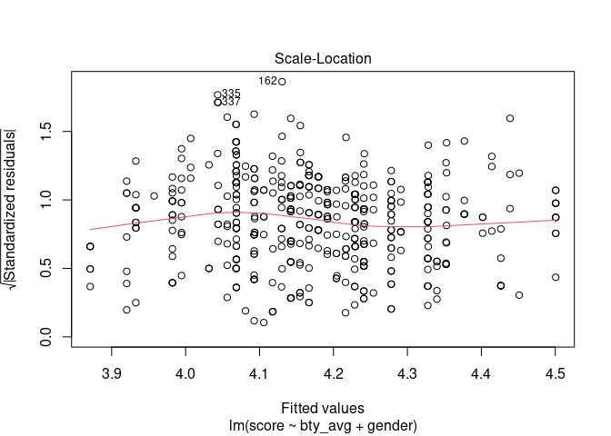<!-- -->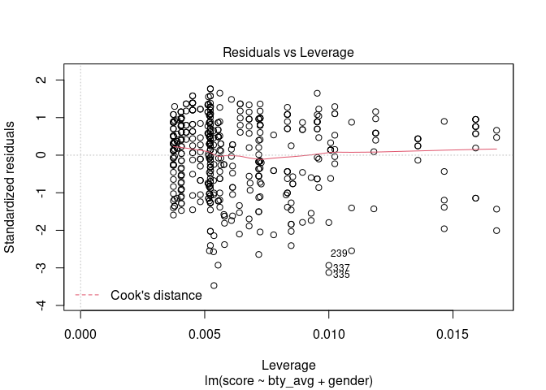<!-- -->

``` r
summary(m_bty_gen)
```

    ## 
    ## Call:
    ## lm(formula = score ~ bty_avg + gender, data = evals)
    ## 
    ## Residuals:
    ##     Min      1Q  Median      3Q     Max 
    ## -1.8305 -0.3625  0.1055  0.4213  0.9314 
    ## 
    ## Coefficients:
    ##             Estimate Std. Error t value Pr(>|t|)    
    ## (Intercept)  3.74734    0.08466  44.266  < 2e-16 ***
    ## bty_avg      0.07416    0.01625   4.563 6.48e-06 ***
    ## gendermale   0.17239    0.05022   3.433 0.000652 ***
    ## ---
    ## Signif. codes:  0 '***' 0.001 '**' 0.01 '*' 0.05 '.' 0.1 ' ' 1
    ## 
    ## Residual standard error: 0.5287 on 460 degrees of freedom
    ## Multiple R-squared:  0.05912,    Adjusted R-squared:  0.05503 
    ## F-statistic: 14.45 on 2 and 460 DF,  p-value: 8.177e-07

### Diagnostic plot:

From the Residuals vs Fitted plot, I do not see any distinctive pattern
which says that this plot doesn’t have non-linear relationships. This
suggests that we can assume linear relationship between the predictors
and the outcome variables.

From the QQ-plot, we can say that most residual points are away from the
straight dashed line. So the model is not normal.

From the Scale-Location plot, the residuals appear randomly spread
around the horizontal line.

From the Residuals vs Leverage plot, there is no influential point near
Cook’s distance line.

Yes it is. Gender variable made beauty average even more significant as
the computed p-valueis even smaller.

### Simplified equation of the line corresponding to female professors: (Female = 0)

Estimated score = beta0hat + beta1hat(bty\_avg) + beta2hat \* 0 =
3.74733824 + 0.07415537(bty\_avg)

Simplified equation of the line corresponding to male professors: (Male
= 1)

Estimated score = beta0hat + beta1hat(bty\_avg) + beta2hat \* 1 =
3.74733824 + 0.07415537(bty\_avg) + 0.17238955

### Interpretation:

Intercept 3.747 is significantly different from zero.

First slope 0.074 is significantly different from 0. For male and female
professors, a 1-unit increase in beauty score is associated with 0.074
increase in the average evaluation score.

Second slope 0.172 is significantly different from 0. For a male and a
female professors with the same beauty scores, male professors’ average
evaluation score is expected to be higher by 0.172 points.

For two professors with the same beauty rating, the male professor tends
to have a higher course evaluation score.

``` r
# Fitting the model with gender removed and rank added in
m_bty_rank <- lm(score ~ bty_avg + rank, data = evals)
tidy(m_bty_rank)
```

    ## # A tibble: 4 × 5
    ##   term             estimate std.error statistic   p.value
    ##   <chr>               <dbl>     <dbl>     <dbl>     <dbl>
    ## 1 (Intercept)        3.98      0.0908     43.9  2.92e-166
    ## 2 bty_avg            0.0678    0.0165      4.10 4.92e-  5
    ## 3 ranktenure track  -0.161     0.0740     -2.17 3.03e-  2
    ## 4 ranktenured       -0.126     0.0627     -2.01 4.45e-  2

``` r
plot(m_bty_rank)
```

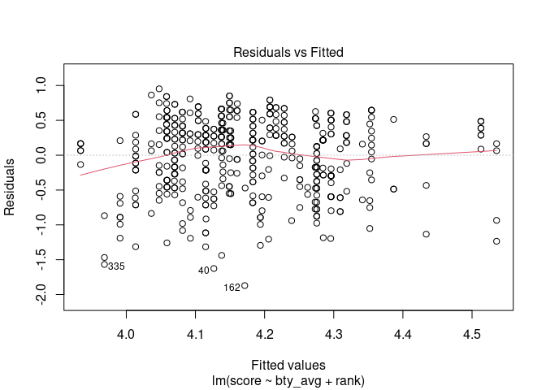<!-- -->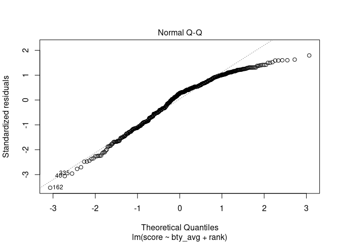<!-- -->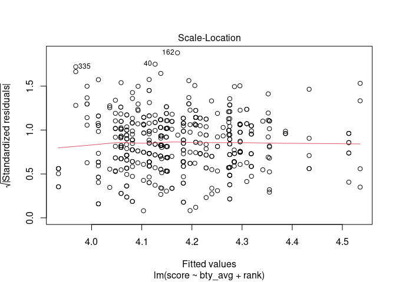<!-- -->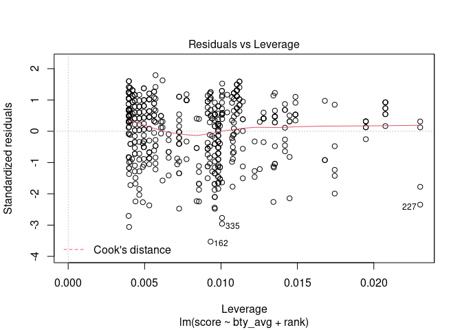<!-- -->

``` r
summary(m_bty_rank)
```

    ## 
    ## Call:
    ## lm(formula = score ~ bty_avg + rank, data = evals)
    ## 
    ## Residuals:
    ##     Min      1Q  Median      3Q     Max 
    ## -1.8713 -0.3642  0.1489  0.4103  0.9525 
    ## 
    ## Coefficients:
    ##                  Estimate Std. Error t value Pr(>|t|)    
    ## (Intercept)       3.98155    0.09078  43.860  < 2e-16 ***
    ## bty_avg           0.06783    0.01655   4.098 4.92e-05 ***
    ## ranktenure track -0.16070    0.07395  -2.173   0.0303 *  
    ## ranktenured      -0.12623    0.06266  -2.014   0.0445 *  
    ## ---
    ## Signif. codes:  0 '***' 0.001 '**' 0.01 '*' 0.05 '.' 0.1 ' ' 1
    ## 
    ## Residual standard error: 0.5328 on 459 degrees of freedom
    ## Multiple R-squared:  0.04652,    Adjusted R-squared:  0.04029 
    ## F-statistic: 7.465 on 3 and 459 DF,  p-value: 6.88e-05

E(Y) = β0 + β1X1 + β2I2 + β3I3

Here Y = Average professor evaluation score, X1 = Quantitative predictor
variable, X2 = Categorical predictor variable (which will further divide
into I1, I2, I3)

I1 = Indicator variable for Teaching which is 0 (slope = 0), I2 =
Indicator variable for Tenure track, I3 = Indicator variable for Tenured

R simply codes the category that comes first alphabetically as a 0.

### Simplified equation of the line corresponding for teaching professors: (Teaching = 0, Tenure track = 0, Tenured = 0)

Estimated score = β0hat + β1hat(bty\_avg) + β2hat \* 0 + β3hat \* 0 =
3.98155 + 0.06783(bty\_avg) + 0 + 0

### Simplified equation of the line corresponding for Tenure track professors: (Tenure track = 1, Tenured = 0)

Estimated score = β0hat + β1hat(bty\_avg) + β2hat \* 1 + β3hat \* 0 =
3.74733824 + 0.07415537(bty\_avg) + (-0.16070) \* 1 + 0

### Simplified equation of the line corresponding for Tenured professors: (Tenure track = 0, Tenured = 1)

Estimated score = β0hat + β1hat(bty\_avg) + β2hat \* 0 + β3hat \* 1 =
3.74733824 + 0.07415537(bty\_avg) + 0 + (-0.12623) \* 1

### bty\_avg x gender interaction

``` r
m_int <- lm(score ~ bty_avg * gender, data = evals)
tidy(m_int)
```

    ## # A tibble: 4 × 5
    ##   term               estimate std.error statistic   p.value
    ##   <chr>                 <dbl>     <dbl>     <dbl>     <dbl>
    ## 1 (Intercept)          3.95      0.118      33.5  2.92e-125
    ## 2 bty_avg              0.0306    0.0240      1.28 2.02e-  1
    ## 3 gendermale          -0.184     0.153      -1.20 2.32e-  1
    ## 4 bty_avg:gendermale   0.0796    0.0325      2.45 1.46e-  2

Since the p-value associated with the interaction term is &lt; 0.05. So
there is a statistically significant interaction between beauty average
rating and gender. In other words, there is evidence that a synergy
effect exists between these 2 variables. Their combination is more
powerful than the sum of their effects.

To study the effect of beauty average rating and gender on the professor
evaluation score.

Y = β0 + β1 X1 + β2 X2 + β3 X1X2

Score = 3.95005984 + 0.03064259 \* bty\_avg - 0.18350903 \* gender +
0.07961855 \* bty\_avg \* gender

For Female:

Score = 3.95005984 + 0.03064259 \* bty\_avg - 0.18350903 \* 0 +
0.07961855 \* bty\_avg \* 0 = 3.950 + 0.0306 \* bty\_avg

For Male:

Score = 3.95005984 + 0.03064259 \* bty\_avg - 0.18350903 \* 1 +
0.07961855 \* bty\_avg \* 1 = 3.766 + 0.1102 \* bty\_avg

From last 2 equations, we can easily see that a 0.0306 unit increase in
beauty average rating has a larger effect on prof evaluation score for
those who are female (coefficient = 0.0306) compared to those who are
male (coefficient = 0.1102).
